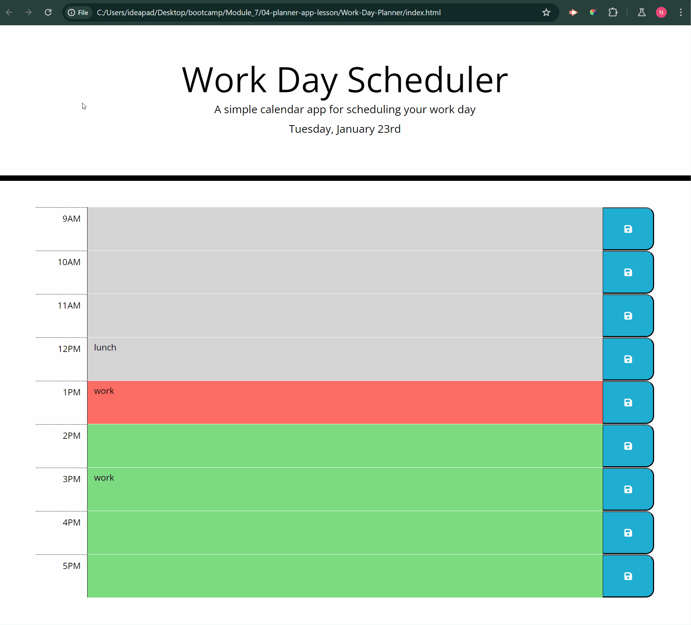

# Work-Day-Planner

---

## Description

This is a simple calendar application designed for busy employees who want to effectively manage their daily schedule. The application runs in the browser and features dynamically updated HTML and CSS powered by jQuery. It utilizes the Day.js library to work with date and time, focusing on using Day.js in the browser.

## Functionality

**Current Day Display:** The application displays the current day at the top of the calendar, providing users with quick access to the current date.

**Timeblocks for Business Hours:** As users scroll down, the app presents timeblocks for standard business hours, allowing them to organize their events throughout the day.

**Color-Coded Timeblocks:** Each timeblock is color-coded to represent whether it is in the past, present, or future. This visual distinction helps users easily identify the current status of each hour.

**Event Entry:** Users can click on a timeblock to enter and save events for that specific hour. The intuitive interface makes it simple for users to manage their schedule.

**Local Storage Integration:** The app saves events to local storage when the user clicks the save button within a timeblock. This ensures that entered events persist between page refreshes.

**Date Utility Library:** The application utilizes the Day.js library to handle date and time functionalities in the browser. This library enhances the app's ability to work seamlessly with various time-related operations.

The following animation shows the web application's appearance and functionality:

## How to Use

To run the calendar application open the [Work-Day-Planner](https://natves.github.io/Work-Day-Planner/) in a web browser. Start adding and saving events to effectively manage your daily schedule.

## Technologies Used

* HTML
* CSS
* JavaScript
* jQuery
* Day.js

## Credits

I'd like to acknowledge [W3Schools](https://www.w3schools.com) and [MDN Web Docs](https://developer.mozilla.org/en-US/) for creating invaluable resources. Also, I want to mention the [Stackoverflow website](https://stackoverflow.com/) where I found new interesting ideas for this project.

## License

Please refer to the LICENSE in the repo.
